# doc_rag — 本地知識庫 RAG 系統

以 PDF 文件為輸入來源，透過 OCR、向量索引與本地大型語言模型（LLM），在完全離線的環境中完成文件問答。

---

## 功能特色

- **PDF 多模態萃取**：同時提取文字、表格（Markdown 格式）與嵌入圖片
- **影像強化 OCR**：對掃描稿件進行雙邊濾波、自適應二值化等前處理，再送入 Tesseract
- **VLM 二次重塑**：可選擇性地將頁面圖片送往本地視覺語言模型（Ollama / LM Studio）重新辨識，補足 OCR 缺失
- **離線向量索引**：使用 `intfloat/multilingual-e5-large-instruct` 嵌入，ChromaDB 持久化儲存
- **Cross-Encoder 重排序**：以 `BAAI/bge-reranker-base` 對語意搜尋結果進行二次精排
- **多 LLM 後端**：支援 Ollama、LM Studio（本地）與 Groq（雲端）
- **完全離線模式**：權重下載完成後可切斷網路，系統自動偵測並鎖定離線環境

---

## 系統需求

| 項目 | 說明 |
|------|------|
| Python | 3.10 以上(建議3.11、不建議3.12-13) |
| Tesseract OCR | 需支援 `chi_tra`（繁體中文）及 `eng` 語言包 |
| LLM 後端 | Ollama 或 LM Studio（本地），或 Groq API 金鑰（雲端） |
| GPU（選配） | 本地 embedding / rerank 模型在 GPU 上速度更快，CPU 亦可運作 |

---

## 安裝

```bash
# 1. 安裝 Python 套件
pip install -r requirements.txt

# 2. 確認 Tesseract 已安裝並包含繁體中文語言包
#    Ubuntu / Debian:
sudo apt install tesseract-ocr tesseract-ocr-chi-tra

#    Windows:
# 使用官網 exe 安裝完成後，chi_tra.traineddata 和 eng.traineddata 要放在 Tesseract-OCR\tessdata 路徑下，並設定為環境變數 TESSDATA_PREFIX

# 3. 啟動服務
python app_flask.py
# 預設監聽 http://127.0.0.1:5000
```

---

## embed 與 rerank 離線模式

首次啟動時若無本地權重，系統會自動從 HuggingFace 下載。下載完成後，將權重放置於以下路徑：

```
model_weights/
├── embed/   # intfloat/multilingual-e5-large-instruct
└── rerank/  # BAAI/bge-reranker-base
```

**註**：目前開放且支援繁體中文之 embedding 和 reranking 模型這兩個堪用。

`config/settings.py` 會自動偵測上述資料夾，若權重存在則設定 `HF_HUB_OFFLINE=1`。

---

## 使用流程



### 1. 系統啟動（`app_flask.py`）

程式啟動時，`config/settings.py` 先檢查 `model_weights/` 資料夾是否存在本地權重。若存在，自動設定 `HF_HUB_OFFLINE=1` 進入離線模式；若不存在，從 HuggingFace 下載。接著呼叫 `preload_and_verify_weights()`，把 Embedding 模型（`multilingual-e5-large-instruct`）與 Reranker（`bge-reranker-base`）載入記憶體做一次驗證，確認可用後立即釋放，最後啟動 Flask 監聽 `127.0.0.1:5000`。

### 2. PDF 索引流程（`indexer/ocr_loader.py` + `indexer/indexer.py`）

這條路徑由前端上傳 PDF 後觸發，在背景執行緒（`background_ocr_worker`）中非同步處理：

1. **頁面轉圖片**：以 200 DPI 把每頁轉成影像。
2. **文字萃取**：優先用 `pdfplumber` 直接讀數位文字層；若文字稀少，改用雙邊濾波＋自適應二值化前處理後送 Tesseract OCR。
3. **表格偵測**：`img2table` 偵測表格並以 Markdown 格式輸出。
4. **切塊**：`convert_pages_to_chunks()` 將文字、表格分別切塊，每塊附上 `page`、`type`、`source` 等 metadata。
5. **向量寫入**：`build_vector_index()` 用 `multilingual-e5-large-instruct` 產生嵌入向量後寫入 ChromaDB，集合名稱為 `collection_{md5(文件名)}`。

### 3. VLM 視覺重塑（選配，`indexer/ocr_loader.py`）

OCR 完成後，可選擇性地把頁面圖片送往本地視覺語言模型（如 LLaVA、Qwen2-VL）做二次辨識，結果以 `type=vlm_text` 的新區塊追加到同一 ChromaDB 集合，彌補 OCR 遺漏的圖表或複雜版面內容。

### 4. 問答生成（retriever/retriever.py + model/llm.py）

用戶提問後，`background_query_worker` 分兩階段處理：

**檢索階段**（`execute_rag_retrieval`）：

- 向量語意搜尋 top-25 結果。
- Cross-Encoder（`bge-reranker-base`）重排序後取前 12 個區塊。
- 若問題中包含「第 N 頁到第 M 頁」語法，額外強制補撈該頁範圍的所有區塊並合併。

**生成階段**：

- 將 12 個區塊組合成固定格式的繁體中文 Prompt（「如參考文本中找不到答案，請告知無法找到，切勿編造」）。
- 根據用戶選擇的 `provider` 路由到 Ollama（`:11434`）、LM Studio（`:1234`）或 Groq（雲端 API）。

### 5. 任務狀態回傳

所有耗時任務（OCR、VLM、問答）都在背景執行緒中執行，結果統一寫入全域 `TASK_STATUS` 字典。前端透過輪詢 `/api/task_status/<task_type>` 取得進度，狀態變更時才寫入日誌（避免雜訊）。每個任務都有對應的 `TaskCancellation` 物件，前端可透過 `/api/cancel/<task_type>` 中途取消。

---

## 目錄結構

```
doc_rag/
├── app_flask.py          # Flask 服務主程式、背景工作執行緒
├── config/
│   └── settings.py       # 路徑、模型名稱、離線模式偵測
├── indexer/
│   ├── ocr_loader.py     # PDF 萃取、影像強化、VLM 重塑管線
│   └── indexer.py        # ChromaDB 寫入
├── retriever/
│   └── retriever.py      # 語意搜尋 + Cross-Encoder 重排序
├── model/
│   ├── embeddings.py     # SentenceTransformer 嵌入封裝
│   ├── rerank.py         # CrossEncoder 重排序封裝
│   └── llm.py            # Ollama / LM Studio / Groq 路由
├── templates/            # Flask HTML 模板
├── model_weights/        # 本地模型權重（自動建立）
├── chromadb_storage/     # 向量資料庫持久化（自動建立）
├── data/
│   ├── raw/              # 上傳的原始 PDF
│   └── processed/        # 萃取的圖片與表格 CSV
└── logs/                 # 每日滾動日誌
```

---

## 日誌功能

應用程式日誌寫入 `logs/rag_system_daily.log`。輪詢端點（`/api/task_status/*`）的存取記錄會被過濾，不寫入日誌也不輸出至終端機，避免雜訊干擾。

---

## 語意搜尋說明



### 路徑 A：語意向量搜尋

1. **問題向量化**：用 `multilingual-e5-large-instruct` 把用戶問題轉成高維向量（支援繁中、英文等多語言）。

2. **ChromaDB 近似最近鄰搜尋**：在該文件的集合（`collection_{doc_id}`）中計算所有區塊的餘弦相似度，回傳前 25 個最接近的候選區塊。這些區塊可能是文字、表格，或 VLM 補充的 vlm_text 類型。

### 路徑 B：頁碼範圍強制補撈

系統用正規表達式偵測問題中是否含有「第 N 頁到第 M 頁」或「第 N～M 頁」這類語法。若有，則直接用 ChromaDB 的 `where` 條件（`metadata.page ∈ [N, M]`）把該頁範圍的所有區塊全部撈出，不限筆數。這是為了確保明確指定頁碼時不因語意距離而漏掉。

### 合併 → Cross-Encoder 精排（取 12）

兩條路徑的結果合併去重後，送給 `bge-reranker-base`。Cross-Encoder 與 Bi-Encoder 最大的差異在於：它把 query 和 chunk 一起輸入模型，讓 attention 層在兩段文字之間充分互動，算出的相關性分數比純向量距離精準得多。代價是每個候選都要跑一次模型，所以只用於篩選這最後的 25 個候選，降序排序後取前 12 個，組成最終送進 LLM 的 `context`。

**說明**：先用快的 Bi-Encoder 大範圍召回，再用精的 Cross-Encoder 精準排序，這是 RAG 系統中的標準「兩階段檢索（Retrieve & Rerank）」模式，在速度和準確性之間取得平衡。
